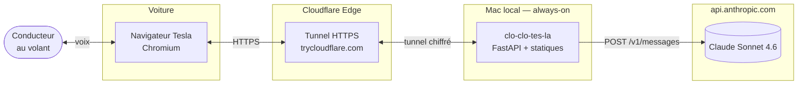
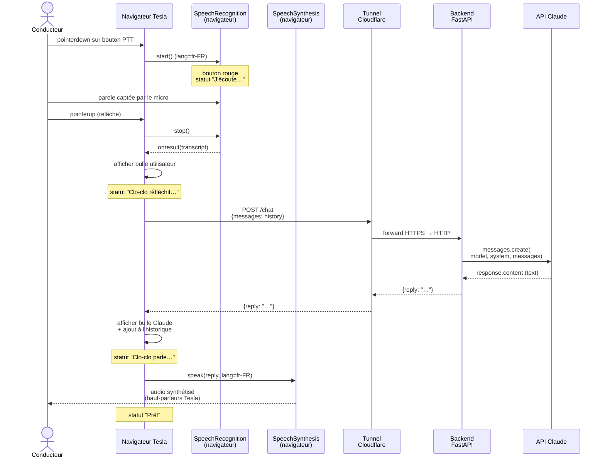

# Architecture — clo-clo-tes-la

> Document vivant — état au 2026-05-23 (MVP, version 0.1). Toute modification structurelle du projet doit être reportée ici.

## 1. Contexte et objectifs

### 1.1 Problème résolu
Le navigateur web embarqué dans les voitures Tesla peut exécuter des webapps tierces. Il existe déjà des projets comme [Taada](https://taada.app) qui exploitent cette surface pour faire tourner Android Auto via streaming WebRTC. **clo-clo-tes-la** suit la même philosophie pour offrir un assistant vocal Claude accessible depuis le tableau de bord de la voiture, sans nécessiter d'application native ni de jailbreak.

### 1.2 Utilisateur cible
Conducteur Tesla individuel, qui veut discuter avec Claude en français pendant ses trajets (idéation, questions générales, copilote de voyage), sans toucher à son téléphone.

### 1.3 Contraintes structurantes
| Contrainte | Conséquence architecturale |
|---|---|
| **Navigateur Tesla** = Chromium ancien, support API web variable | Pas d'API moderne supposée acquise. Web Speech API à valider expérimentalement. |
| **Mic web** = HTTPS obligatoire (origine sécurisée) | Tunnel HTTPS indispensable, même en dev. |
| **Conducteur attentif à la route** | Réponses vocales courtes, UX push-to-talk simple (un seul gros bouton), pas de lecture d'écran. |
| **Projet personnel, budget MVP** | Pas d'infra cloud, pas de DB, pas d'auth. Hébergement sur Mac local. |
| **Objectif d'apprentissage SDLC** | Documentation explicite, conventions claires, séparation propre frontend/backend. |

### 1.4 Périmètre MVP (v0.1)
**Inclus :** push-to-talk, conversation FR avec Claude, historique en mémoire client, déploiement local via cloudflared.
**Exclus :** authentification, persistance, wake-word, multi-utilisateurs, mode hands-free, intégration GPS, voix premium.

---

## 2. Vue d'ensemble (diagramme de contexte)



Quatre acteurs / composants :

1. **Conducteur** : émet et reçoit de l'audio en français.
2. **Navigateur Tesla** : exécute la SPA, capture l'audio (Web Speech Recognition), restitue l'audio (Web Speech Synthesis).
3. **Backend local + tunnel Cloudflare** : sert la SPA et relaie l'appel API Claude. Le tunnel donne une URL HTTPS publique sans avoir à exposer le Mac directement à Internet.
4. **API Anthropic** : génère la réponse texte.

---

## 3. Composants

### 3.1 Frontend — SPA statique

**Fichiers :** [frontend/index.html](../frontend/index.html), [frontend/app.js](../frontend/app.js), [frontend/style.css](../frontend/style.css).

**Stack :** HTML/CSS/JavaScript vanilla. Aucun framework, aucun build step. Servi en statique par le backend FastAPI via `StaticFiles`.

**Responsabilités :**
- Afficher l'UI push-to-talk (un gros bouton circulaire, deux bulles de transcript, un indicateur de statut).
- Gérer le cycle d'écoute via `webkitSpeechRecognition` (STT, langue `fr-FR`).
- Maintenir l'historique de conversation en mémoire (variable `history` côté client).
- Appeler `POST /chat` avec l'historique complet à chaque tour.
- Restituer la réponse via `SpeechSynthesisUtterance` (TTS, langue `fr-FR`).

**Choix de conception :**
- **Pas de framework** : MVP, surface minimale, débogage trivial dans n'importe quel navigateur.
- **Push-to-talk via `pointerdown`/`pointerup`** plutôt que click : meilleur retour visuel (état "appuyé"), pas d'ambiguïté sur quand l'app écoute.
- **Historique côté client** : pas besoin de session backend, simplicité maximale. Limite : conversation perdue au refresh.
- **Web Speech API** vs enregistrement audio + Whisper : si elle marche dans la Tesla, c'est zéro coût STT et latence quasi-nulle. À valider — c'est le **risque #1 du projet**.

### 3.2 Backend — FastAPI

**Fichier :** [backend/main.py](../backend/main.py).

**Stack :** Python 3.12, FastAPI 0.115, Uvicorn 0.32, SDK Anthropic 0.104, python-dotenv.

**Endpoints :**

| Méthode | Chemin | Rôle |
|---|---|---|
| `POST` | `/chat` | Reçoit `{messages: [{role, content}, …]}`, appelle Claude, retourne `{reply: "…"}`. |
| `GET` | `/healthz` | Check de vie : `{status, model}`. Pratique pour valider le tunnel. |
| `GET` | `/`, `/index.html`, `/app.js`, `/style.css` | Sert les statiques du dossier `frontend/`. |

**Configuration via environnement** (chargée depuis `.env` avec `override=True`) :

| Variable | Défaut | Rôle |
|---|---|---|
| `ANTHROPIC_API_KEY` | *(obligatoire)* | Clé d'authentification API Anthropic. |
| `CLOCLO_MODEL` | `claude-sonnet-4-6` | ID du modèle à utiliser. Swap facile pour Haiku 4.5 (plus rapide/moins cher) ou Opus 4.7 (plus capable). |

**Prompt système :** définit l'identité "Clo-clo", impose réponses courtes (2-3 phrases), français, style oral pur (pas de markdown). Voir constante `SYSTEM_PROMPT` dans [backend/main.py](../backend/main.py).

**CORS :** `allow_origins=["*"]` pour le MVP. À restreindre dès qu'un domaine stable est utilisé (voir §7).

### 3.3 Tunnel HTTPS — cloudflared

**Pourquoi un tunnel ?**
Les APIs `getUserMedia` (micro) et `SpeechRecognition` exigent une **origine sécurisée** (HTTPS ou `localhost`). Le navigateur Tesla voit le Mac comme une origine externe → HTTPS obligatoire. Acheter un certificat + exposer le port du Mac à Internet serait disproportionné.

**Mode actuel — Quick Tunnel :**
```bash
cloudflared tunnel --url http://localhost:8000
```
- Cloudflare génère une URL aléatoire éphémère (`https://xxxx.trycloudflare.com`).
- Tunnel **sortant** : le Mac n'a pas besoin d'ouvrir de port entrant ; cloudflared maintient une connexion permanente vers l'edge Cloudflare.
- Gratuit, instantané, aucun compte requis.
- **Limite** : URL aléatoire qui change à chaque relance. Pas adapté à l'usage quotidien (à retaper dans la Tesla à chaque fois).

**Évolution prévue — Named Tunnel :**
URL stable du type `cloclo.mon-domaine.fr`. Nécessite un nom de domaine et le DNS géré par Cloudflare. Mise en place documentée à part le moment venu.

---

## 4. Flux d'une interaction (diagramme de séquence)



---

## 5. Modèle de données

Aucune persistance — état entièrement volatil.

**Format des messages échangés avec `/chat`** :

```json
{
  "messages": [
    { "role": "user",      "content": "Bonjour Clo-clo" },
    { "role": "assistant", "content": "Salut ! Que puis-je faire ?" },
    { "role": "user",      "content": "Quelle est la capitale du Pérou ?" }
  ]
}
```

Réponse :
```json
{ "reply": "Lima." }
```

L'historique grossit à chaque tour. Aucune compression / résumé automatique pour l'instant — à surveiller si conversations longues (impact coût + latence).

---

## 6. Choix technologiques — arbitrages

| Choix | Alternative écartée | Raison |
|---|---|---|
| **FastAPI** | Flask, Django, Node/Express | Async natif, validation Pydantic gratuite, OpenAPI auto, idéal pour proxy simple. |
| **HTML/JS vanilla** | React, Vue, Svelte | Pas de build, surface minimale, débogage trivial dans le navigateur Tesla. Une seule page de toute façon. |
| **Web Speech API** | MediaRecorder → Whisper backend | Latence ~zéro, coût zéro, code 10× plus simple. **Risque : compat Tesla.** Plan B documenté §8. |
| **SpeechSynthesis (TTS navigateur)** | ElevenLabs, OpenAI TTS | Gratuit, voix française correcte. Upgrade ElevenLabs prévu en v2 pour qualité supérieure. |
| **Cloudflared quick tunnel** | ngrok, frp, port forwarding + Let's Encrypt | Gratuit, sortant uniquement (sécurité), instantané, suffisant pour MVP. |
| **Claude Sonnet 4.6** | Haiku 4.5 (plus rapide), Opus 4.7 (plus capable) | Sonnet = équilibre qualité/latence pour conversation casual. Switch trivial via `CLOCLO_MODEL`. |
| **`.env` + python-dotenv** | Secrets manager (Vault, 1Password CLI…) | Projet perso, 1 secret unique, surface minimale. |

---

## 7. Sécurité

### Modèle de menace (MVP)
| Risque | Mitigation actuelle | À durcir |
|---|---|---|
| Fuite de la clé API Anthropic | `.env` gitignored ; `.env.example` ne contient qu'un placeholder | RAS |
| Endpoint `/chat` public sans auth | Aucune | **v0.2** : token bearer dans header, validé par middleware FastAPI |
| Abus de coût (qqn devine l'URL trycloudflare) | URL aléatoire éphémère | Idem : auth bearer, et budget cap côté Anthropic console |
| CORS ouvert (`*`) | Acceptable car endpoint sans auth ni cookie | Restreindre à `https://cloclo.<domaine>` quand tunnel nommé |
| MITM | HTTPS de bout en bout (TLS terminé par Cloudflare, puis tunnel chiffré jusqu'au Mac) | RAS |
| Charge utile malveillante (`messages` contenant code/JS) | Backend ne fait que forwarder, frontend rend uniquement en `textContent` (pas `innerHTML`) | RAS |
| Injection de prompt visant à exfiltrer | Pas de données sensibles côté backend, pas de tools, pas de RAG | RAS pour MVP |

### Hygiène
- `load_dotenv(override=True)` pour neutraliser une éventuelle vieille valeur env (cf. note `claude-code-env-injection`).
- Aucune dépendance JS externe → pas de risque de supply chain frontend.
- Dépendances Python pinnées (versions exactes dans [backend/requirements.txt](../backend/requirements.txt)).

---

## 8. Limites connues

1. **Web Speech API Tesla : non vérifié.** Le navigateur Tesla est un Chromium ancien dont le support des APIs vocales n'est pas documenté. Si le test du jalon échoue : **Plan B** — `MediaRecorder` côté frontend (mieux supporté), POST de l'audio vers un nouvel endpoint `/transcribe` (Whisper API ou modèle local), retour du texte, puis flux `/chat` inchangé.
2. **Tunnel quick éphémère.** URL change à chaque redémarrage. Solution : named tunnel + domaine perso (post-MVP).
3. **Mac obligatoirement allumé.** Single point of failure. À terme : déploiement sur un Raspberry Pi domestique ou petit VPS.
4. **Pas d'auth.** Toute personne avec l'URL peut consommer ta quota Claude.
5. **Pas de gestion d'erreur réseau côté frontend.** Pas de retry, pas de timeout explicite, pas de mode dégradé hors-ligne.
6. **Pas de tests automatisés.** À ajouter avant toute évolution structurelle.
7. **Conversation perdue au refresh.** OK pour MVP, à persister en `sessionStorage` au minimum.
8. **Aucun logging structuré.** Uvicorn logs stdout uniquement, pas d'observabilité au-delà.
9. **Pas de limite de longueur historique.** Une conversation très longue finira par : (a) coûter cher, (b) approcher la fenêtre de contexte du modèle.
10. **Comportement audio en roulant non testé.** Le bruit de route, les annonces GPS, et les éventuelles coupures audio Tesla (téléphone qui sonne, etc.) peuvent dégrader fortement l'UX.

---

## 9. Évolution possible — feuille de route indicative

| Version | Périmètre | Effort estimé |
|---|---|---|
| **v0.1 (actuel)** | MVP : PTT + Web Speech API + tunnel quick | livré |
| **v0.2** | Auth bearer token, persistance historique en `sessionStorage`, gestion d'erreur réseau (toast + retry) | 1 soirée |
| **v0.3** | Plan B Whisper si Web Speech API KO + bascule automatique selon capacités navigateur | 1 week-end |
| **v0.4** | Tunnel nommé Cloudflare + domaine perso + service launchd auto-démarrage | 1 soirée |
| **v0.5** | Tests pytest (backend) + GitHub Actions CI | 1 week-end |
| **v1.0** | Streaming réponse Claude + TTS phrase-par-phrase pour réduire la latence perçue | 1 week-end |
| **v1.1** | Voix ElevenLabs FR premium (option) | 1 soirée |
| **v2.0** | Wake-word "Hey Clo-clo" (Porcupine ou équivalent) | 1 week-end |
| **v2.1** | Tool use Claude : météo, position GPS via téléphone compagnon, recherche POI, contrôle musique | 1 semaine |
| **v3.0** | Migration Mac local → VPS / Raspberry Pi avec observabilité (logs structurés, Grafana) | 1 week-end |

---

## 10. Coûts d'exploitation estimés (régime MVP)

| Poste | Hypothèse | Coût mensuel |
|---|---|---|
| API Claude (Sonnet 4.6) | 50 interactions / jour, ~500 tokens in + 100 tokens out chacune | ~3-5 € |
| Cloudflare quick tunnel | Trafic < 100 Mo / mois | 0 € |
| Électricité Mac always-on | Mac mini M2, ~7W idle, 24/7 | ~1 € |
| Domaine perso (post-MVP, optionnel) | `.fr` ou `.com` chez OVH/Gandi | ~1 € (10-12 € / an) |
| **Total MVP** | | **< 5 € / mois** |

---

## 11. Glossaire

- **PTT** : Push-to-Talk. Mode où on appuie sur un bouton pour parler, on relâche pour arrêter.
- **STT** : Speech-to-Text (reconnaissance vocale). Audio → texte.
- **TTS** : Text-to-Speech (synthèse vocale). Texte → audio.
- **Web Speech API** : standard W3C couvrant `SpeechRecognition` (STT) et `SpeechSynthesis` (TTS) dans le navigateur.
- **VAD** : Voice Activity Detection. Détecte automatiquement quand quelqu'un parle (vs silence).
- **Wake-word** : mot-clé qui réveille l'assistant ("Hey Siri", "Alexa"…).
- **SPA** : Single Page Application.
- **Quick tunnel** (cloudflared) : tunnel HTTPS avec URL aléatoire éphémère, sans compte Cloudflare requis.
- **Named tunnel** (cloudflared) : tunnel HTTPS avec hostname stable, associé à un compte Cloudflare et un domaine.

---

## 12. Décisions architecturales — journal

| Date | Décision | Raison |
|---|---|---|
| 2026-05-23 | Stack initiale : FastAPI + HTML vanilla + Web Speech API + cloudflared quick tunnel | MVP en un week-end, validation rapide du risque #1 (compat navigateur Tesla) |
| 2026-05-23 | Modèle par défaut : Claude Sonnet 4.6 | Équilibre qualité/latence/coût pour conversation casual en français |
| 2026-05-23 | Historique en mémoire client uniquement | Simplicité maximale, pas de session serveur à gérer |
| 2026-05-23 | `load_dotenv(override=True)` | Robustesse face à un env hérité contenant déjà la variable (cas : lancement via Claude Code) |
